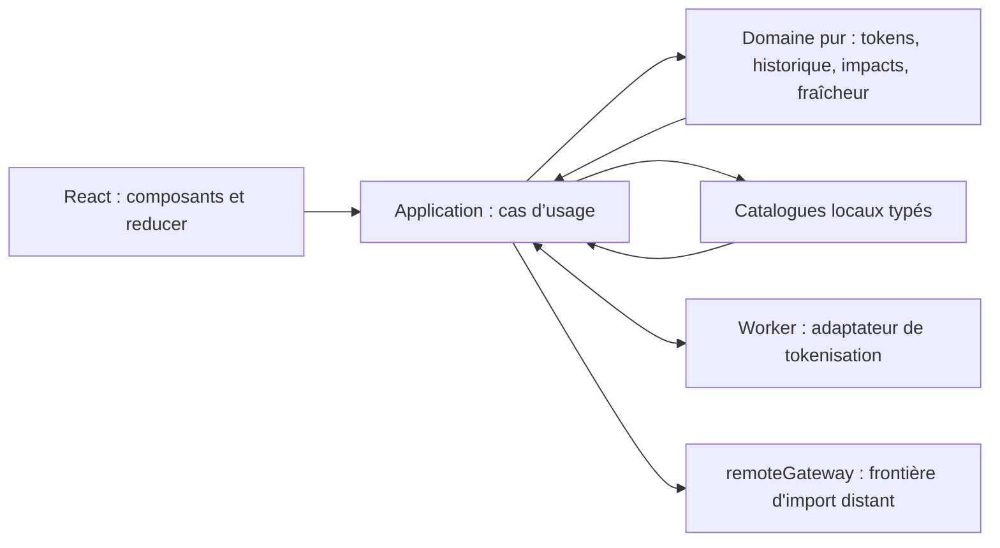
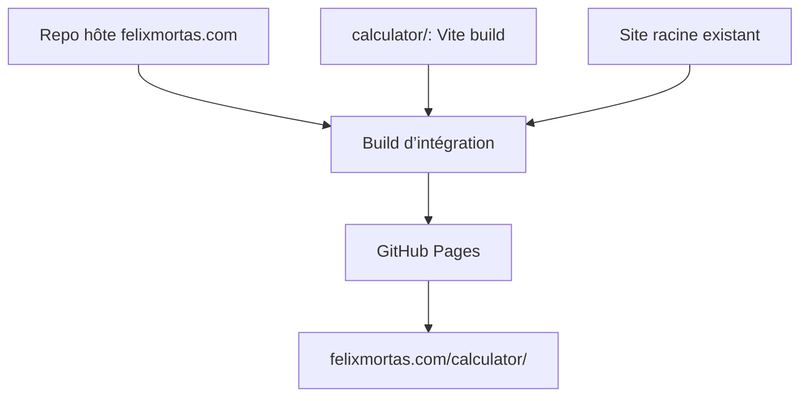
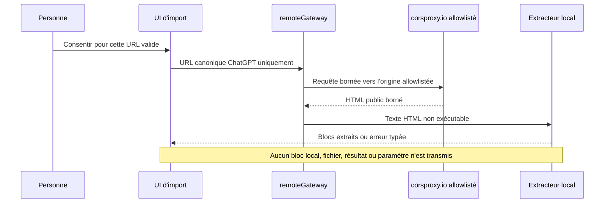

# Architecture Spine — Calculateur d’empreinte environnementale des LLM

## Design Paradigm

Application monopage client-side, en couches, avec un noyau de domaine fonctionnel pur. React rend l’état de session ; l’application orchestre les cas d’usage ; le domaine calcule et valide sans dépendre du navigateur, de React ni du catalogue concret.



## Invariants & Rules

### AD-1 — Sous-projet portable et publication statique [ADOPTED]

- **Binds:** NFR-2, intégration dans le dépôt hôte
- **Prevents:** une dépendance au framework ou au mode de publication du site parent.
- **Rule:** `calculator/` contient son propre projet Vite et produit `dist/` avec une base `/calculator/`. Le dépôt hôte monte le contenu de ce dossier à `/calculator/` dans son artefact GitHub Pages, sans écraser les fichiers du site racine ; le sous-projet n’écrit pas dans les sources du site parent.

### AD-2 — Dépendances dirigées vers le noyau [ADOPTED]

- **Binds:** FR-3, FR-4, FR-8, FR-19, FR-24, NFR-6
- **Prevents:** des formules ou règles de fraîcheur réparties dans les composants React, le worker et les données.
- **Rule:** seuls les modules `application` appellent les adaptateurs navigateur et assemblent les cas d’usage. `domain` est synchrone, déterministe et sans import React, Worker, `Intl` ou fichier de données. `ui` ne calcule pas ; il envoie des intentions au reducer et affiche ses états.

### AD-3 — Session éphémère et résultats traçables [ADOPTED]

- **Binds:** FR-10 à FR-14, FR-17, FR-18, FR-21, NFR-3, NFR-4
- **Prevents:** la conservation accidentelle d’une conversation, le total calculé sur des résultats périmés, ou des invalidations dépendantes de l’ordre de rendu.
- **Rule:** un unique reducer React possède les textes, les sélections et les surcharges de session. Le domaine produit une représentation canonique, ordonnée et comparée octet à octet pour chaque empreinte : `impactFingerprint` couvre les entrées pertinentes, paramètres d’impact résolus, catalogue et version d’algorithme ; `showerFingerprint` couvre `impactFingerprint`, pays utilisateur et paramètres douche. La fraîcheur est dérivée de ces empreintes : une modification douche ne périt que l’équivalence, jamais les impacts. Total et équivalences n’utilisent que leurs dépendances actuelles. Aucun stockage durable, analytics, cookie applicatif ou journalisation distante n’est permis.

### AD-4 — Tokenisation locale isolée [ADOPTED]

- **Binds:** FR-3, FR-8, FR-19, NFR-3
- **Prevents:** un envoi de texte, un blocage de l’interface lors de gros collages ou deux méthodes de comptage divergentes.
- **Rule:** l’application ne parle au tokenizer qu’au travers d’un protocole typé de Worker. Chaque demande et réponse contient `requestId` et `tokenizationFingerprint` (texte et encodage) ; le reducer ignore une réponse qui ne correspond plus à la demande en attente. Un calcul attend ses comptes, ou leur fallback. Le Worker embarque `js-tiktoken/lite` et les rangs `o200k_base` dans le bundle ; il ne charge ni CDN ni API. Il renvoie un compte ou une erreur structurée, qui déclenche le fallback unique `mots / 0,75` du domaine.

### AD-5 — Catalogues de référence immuables et surcharges de session [ADOPTED]

- **Binds:** FR-1, FR-2, FR-15, FR-17, FR-20, FR-23, FR-24, NFR-6
- **Prevents:** des constantes dispersées, des prix mêlés aux formules, ou la modification durable des données publiées par les paramètres avancés.
- **Rule:** modèles, tarifs et calibration, constantes, facteurs environnementaux, risques, valeurs Monde et correspondances fuseau-pays sont des catalogues locaux versionnés, validés avant build et accompagnés de provenance. Une unique fonction de domaine résout chaque paramètre : clé normalisée, valeur du pays choisi, repli Monde du même facteur, puis surcharge de session autorisée ; elle renvoie un statut de repli ou d’indisponibilité. Une donnée indispensable absente sans repli ni surcharge valide bloque le résultat dépendant. Le prompt système provient exclusivement du catalogue et ne peut pas être surchargé. Les réglages avancés créent une vue de paramètres résolus en mémoire ; ils ne mutent jamais les catalogues.

### AD-6 — Localisation indicative sans donnée externe [ADOPTED]

- **Binds:** FR-5, FR-23, NFR-3
- **Prevents:** une localisation IP/GPS contraire à la confidentialité ou la présentation d’un pays comme certain.
- **Rule:** les pays sont des codes ISO 3166-1 alpha-2. Le pays utilisateur proposé vient d’abord d’une table locale déterministe fuseau IANA → pays probable, puis de la région de la locale navigateur, puis de Monde. Il est qualifié d’indicatif, visible et modifiable. Le pays utilisateur ne peut alimenter que l’équivalence douche ; le pays d’hébergement alimente les impacts et le risque de sécheresse.

### AD-7 — Internationalisation par messages, non par branchements métier [ADOPTED]

- **Binds:** FR-6, FR-22, NFR-5
- **Prevents:** des textes français dans les calculs ou une seconde locale qui change des nombres de référence.
- **Rule:** tout texte utilisateur est adressé par clé dans des catalogues de messages typés ; `fr-FR` est la seule locale distribuée au lancement. Les formats d’affichage passent par `Intl`. Les identifiants, unités internes, formules, valeurs de catalogues et empreintes ne dépendent pas de la langue.

### AD-8 — Import distant exceptionnel, consenti et allowlisté [ADOPTED]

- **Binds:** FR-3, FR-8, FR-19, NFR-3, D-4
- **Prevents:** l'exfiltration de données de session, une URL proxy arbitraire, le contournement d'un contrôle d'accès, ou la propagation d'une dépendance tierce dans le domaine de calcul.
- **Rule:** `application/import/remoteGateway` est le seul adaptateur autorisé à faire une requête d'import distant. Il ne peut être appelé qu'après un consentement explicite, ponctuel et non pré-coché pour la requête courante ; un refus, une annulation ou une modification de l'URL annule l'autorisation et ne lance aucune requête. Il accepte uniquement une URL de partage ChatGPT publique déjà validée par le validateur existant et construit la requête à partir de cette seule valeur.
- **Allowlist transitoire:** l'origine de production est exactement `https://corsproxy.io/`; aucune origine, chemin de proxy ou redirection ne provient d'une entrée utilisateur. La configuration associe cette origine à son mécanisme de clé API et d'autorisation de domaine. Une clé embarquée dans l'application statique n'est jamais considérée comme un secret : les protections effectives sont l'autorisation de domaine et les plafonds configurés chez le fournisseur, complétés par la validation, les délais et les limites applicatives.
- **Minimisation et traitement:** la passerelle n'envoie ni bloc local, fichier, résultat, catalogue, paramètre de calcul, état du reducer, cookie applicatif, jeton de session ni secret. Le tiers reçoit nécessairement l'URL de partage et, selon sa politique, peut recevoir l'adresse IP, l'agent utilisateur et des métadonnées de requête ; l'application ne promet pas que la page ou son contenu ne seront jamais traités par lui. La réponse HTML est bornée en taille et en délai, lue comme texte non exécutable et parsée localement par l'extracteur existant ; aucun lien, artifact ou ressource citée n'est suivi ou téléchargé.
- **Défaillance et remplacement:** une erreur de consentement, de politique, réseau, délai, taille ou format est typée, atomique et conserve la session ; le parcours manuel/local reste disponible. `corsproxy.io` est une dépendance transitoire : son origine et son contrat restent confinés à la configuration de `remoteGateway` afin qu'un proxy géré par le projet puisse le remplacer ultérieurement sans changement du domaine, du parseur ou de l'interface de consentement. Toute évolution de la politique ou des conditions du fournisseur déclenche une revue de D-4 et peut désactiver cette voie au profit de l'import manuel.

## Consistency Conventions

| Concern | Convention |
| --- | --- |
| Types et erreurs | `camelCase`; identifiants stables `blockId`; erreurs attendues en union discriminée `code` + contexte non sensible. |
| Nombres et unités | Calculs non arrondis en Wh, gCO2e et L ; seul l’affichage formate et arrondit. Aucun `NaN` ou infini ne franchit la frontière du domaine. |
| Données | Les fichiers portent `schemaVersion`, `dataVersion`, provenance et date de calibration ; une valeur environnementale absente cherche seulement sa valeur Monde du même facteur. |
| Mutation | Les actions du reducer sont les seules mutations de session. Une mutation ne lance jamais de calcul sans intention utilisateur explicite. |
| Confidentialité | Par défaut, les messages de conversation ne figurent ni dans une URL, ni dans un log, ni dans un stockage navigateur durable. La seule exception est l'URL canonique d'un partage ChatGPT, transmise à l'origine allowlistée après consentement conforme à AD-8 ; aucun contenu local n'est inclus par le calculateur. |

## Stack

| Name | Version |
| --- | --- |
| React et React DOM | 19.3.0 |
| TypeScript | 7.0.2 |
| Vite | 7.3.3 |
| js-tiktoken | 1.0.21 |
| Vitest | 5.0.1 |
| GitHub Pages | service géré |

## Structural Seed

```text
calculator/
  src/
    ui/                 # composants React, accessibilité, présentation
    application/        # reducer, cas d’usage, orchestration du Worker
      import/           # validation, extracteur local et remoteGateway isolé
    domain/             # règles pures : historique, diff, impacts, validation, fraîcheur
    data/               # catalogues locaux, schémas et métadonnées de sources
    i18n/               # messages fr-FR et formatage
    workers/            # protocole et implémentation de tokenisation
  tests/                # jeux de référence et tests de domaine/Worker
  public/               # actifs statiques propres au calculateur
  vite.config.ts        # base /calculator/ et sortie statique
```





## Capability → Architecture Map

| Capability / Area | Lives in | Governed by |
| --- | --- | --- |
| Saisie, blocs, calcul manuel et péremption | `ui/`, `application/`, `domain/` | AD-2, AD-3 |
| Historique, artifact et total | `domain/` | AD-2, AD-3 |
| Comptage local et fallback | `workers/`, `domain/` | AD-2, AD-4 |
| Modèles, paramètres avancés et calcul environnemental | `data/`, `application/`, `domain/` | AD-3, AD-5 |
| Pays, eau, carbone, sécheresse et douche | `data/`, `domain/`, `ui/` | AD-5, AD-6 |
| Français et extensions de langues | `i18n/`, `ui/` | AD-7 |
| Consentement et import de partage distant | `ui/`, `application/import/` | AD-8 |
| Publication GitHub Pages | `calculator/` et workflow du repo hôte | AD-1 |

## Deferred

- Granularité exacte du diff d’artifact, segmentation des mots de fallback, règles d’arrondi et bornes numériques : D-2 du PRD les fixe avant les tests de référence ; ils ne modifient pas les frontières ci-dessus.
- Schéma concret et contenu du catalogue `models_params`, calibration tarifaire et processus de mise à jour : D-1/D-6 ; ils doivent satisfaire AD-5 avant publication.
- Choix définitif du proxy géré par le projet, y compris son origine, son contrat de traitement et ses protections opérationnelles : il remplacera `corsproxy.io` par changement de configuration de `remoteGateway`, après revue D-4 et du consentement ; il ne change pas le domaine, le parseur local ou les calculs.
- Workflow GitHub Actions précis du dépôt hôte : décidé lors de l’intégration ; il doit respecter AD-1 et publier aussi le site racine.
