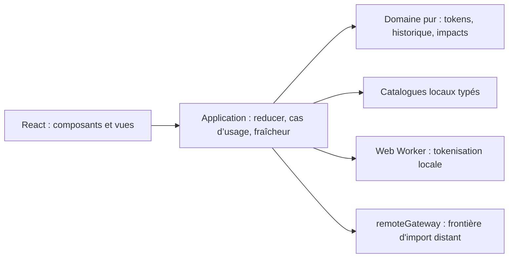
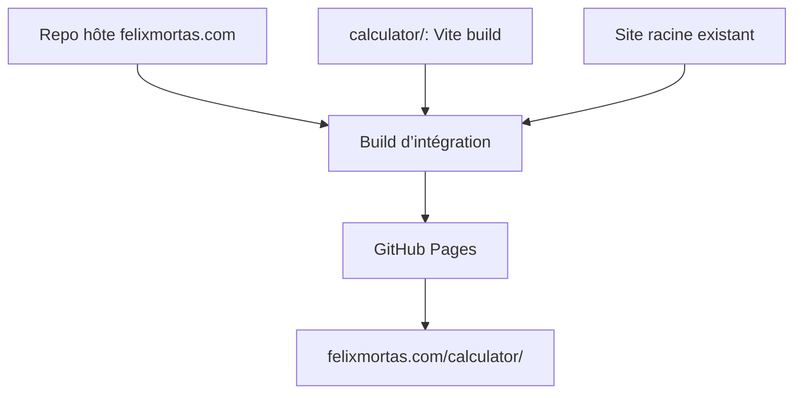
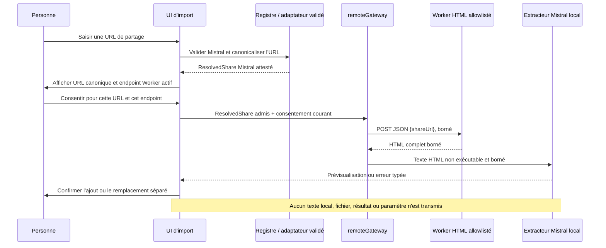

# Architecture Spine — Calculateur d’empreinte environnementale des LLM

## Design Paradigm

Application monopage client-side, en couches, avec un noyau de domaine fonctionnel pur. React rend l’état de session ; l’application orchestre les cas d’usage ; le domaine calcule et valide sans dépendre du navigateur, de React ni du catalogue concret.



## Invariants & Rules

### AD-1 — Sous-projet portable et publication statique [ADOPTED]

- **Binds:** NFR-2, intégration dans le dépôt hôte
- **Prevents:** une dépendance au framework ou au mode de publication du site parent.
- **Rule:** `calculator/` contient son propre projet Vite et produit `dist/` avec une base `/calculator/`. Le dépôt hôte monte le contenu de ce dossier à `/calculator/` dans son artefact GitHub Pages, sans écraser les fichiers du site racine ; le sous-projet n’écrit pas dans les sources du site parent.

### AD-2 — Dépendances dirigées vers le noyau [ADOPTED]

- **Binds:** FR-3, FR-4, FR-8, FR-19, FR-24, NFR-6
- **Prevents:** des formules ou règles de fraîcheur réparties dans les composants React, le worker et les données.
- **Rule:** seuls les modules `application` appellent les adaptateurs navigateur et assemblent les cas d’usage. `domain` est synchrone, déterministe et sans import React, Worker, `Intl` ou fichier de données. `ui` ne calcule pas ; il envoie des intentions au reducer et affiche ses états.

### AD-3 — Session éphémère et résultats traçables [ADOPTED]

- **Binds:** FR-10 à FR-14, FR-17, FR-18, FR-21, NFR-3, NFR-4
- **Prevents:** la conservation accidentelle d’une conversation, le total calculé sur des résultats périmés, ou des invalidations dépendantes de l’ordre de rendu.
- **Rule:** un unique reducer React possède les textes, les sélections et les surcharges de session ; accueil, fil et bilan sont des vues de cette même session et un retour d’étape conserve les textes. `application` construit les empreintes déterministes à partir de l’état et des paramètres résolus : `impactFingerprint` couvre les entrées pertinentes, paramètres d’impact résolus, catalogue et version d’algorithme ; `showerFingerprint` couvre `impactFingerprint`, pays utilisateur et paramètres douche. La fraîcheur est dérivée de ces empreintes : une modification douche ne périt que l’équivalence, jamais les impacts. Chaque calcul part d’une intention explicite ; modifier un texte, un modèle ou un paramètre ne recalcule rien. « Tout calculer » calcule tous les échanges renseignés, attend leurs résultats actuels, puis agrège ; « Recalculer le total » n’effectue aucun calcul d’échange et désigne les résultats manquants ou périmés. Les réponses tardives restent soumises aux empreintes. Aucun total ancien ou incomplet n’est présenté comme actuel. Aucun stockage durable, analytics, cookie applicatif ou journalisation distante n’est permis.

### AD-4 — Tokenisation locale isolée [ADOPTED]

- **Binds:** FR-3, FR-8, FR-19, NFR-3
- **Prevents:** un envoi de texte, un blocage de l’interface lors de gros collages ou deux méthodes de comptage divergentes.
- **Rule:** l’application ne parle au tokenizer qu’au travers d’un protocole typé de Worker. Chaque demande et réponse contient `requestId` et `tokenizationFingerprint` (texte et encodage) ; le reducer ignore une réponse qui ne correspond plus à la demande en attente. Un calcul attend ses comptes, ou leur fallback. Le Worker embarque `js-tiktoken/lite` et les rangs `o200k_base` dans le bundle ; il ne charge ni CDN ni API. Il renvoie un compte ou une erreur structurée, qui déclenche le fallback unique `mots / 0,75` du domaine.

### AD-5 — Catalogues de référence immuables et surcharges de session [ADOPTED]

- **Binds:** FR-1, FR-2, FR-15, FR-17, FR-20, FR-23, FR-24, NFR-6
- **Prevents:** des constantes dispersées, des prix mêlés aux formules, ou la modification durable des données publiées par les paramètres avancés.
- **Rule:** modèles, tarifs et calibration, constantes, facteurs environnementaux, risques, valeurs Monde et correspondances fuseau-pays sont des catalogues locaux versionnés, validés avant build et accompagnés de provenance. La clé fournisseur est normalisée entre modèles et pays d’hébergement ; chaque référence de modèle doit résoudre ses facteurs et son pays avant publication. Une table locale unique propose les références ChatGPT `sans abonnement → gpt-5.6-luna`, `avec abonnement → gpt-5.6-terra`, et Mistral `rapide → mistral-small`, `réflexion → mistral-large` ; si le mode Mistral d’un import est inconnu, la personne le choisit. Ce préremplissage est une estimation : le choix explicite valide de la personne prévaut, et le reducer accepte le choix direct de tout modèle valide du chatbot sélectionné, ChatGPT compris, pour toute la conversation. Une unique fonction de `data/modelCatalog`, appelée par `application`, résout chaque paramètre : clé normalisée, valeur du pays choisi, repli Monde du même facteur, puis surcharge de session autorisée ; elle renvoie un statut de repli ou d’indisponibilité. `domain` reçoit les paramètres résolus, sans dépendre du catalogue concret. Une donnée indispensable absente sans repli ni surcharge valide bloque le résultat dépendant. Le prompt système provient exclusivement du catalogue et ne peut pas être surchargé. Les réglages avancés créent une vue de paramètres résolus en mémoire ; ils ne mutent jamais les catalogues.

### AD-6 — Localisation indicative sans donnée externe [ADOPTED]

- **Binds:** FR-5, FR-23, NFR-3
- **Prevents:** une localisation IP/GPS contraire à la confidentialité ou la présentation d’un pays comme certain.
- **Rule:** les pays sont des codes ISO 3166-1 alpha-2. Le pays utilisateur proposé vient d’abord d’une table locale déterministe fuseau IANA → pays probable, puis de la région de la locale navigateur, puis de Monde. Il est qualifié d’indicatif, visible et modifiable. Le pays utilisateur ne peut alimenter que l’équivalence douche ; le pays d’hébergement alimente les impacts et le risque de sécheresse.

### AD-7 — Internationalisation par messages, non par branchements métier [ADOPTED]

- **Binds:** FR-6, FR-22, NFR-5
- **Prevents:** des textes français dans les calculs ou une seconde locale qui change des nombres de référence.
- **Rule:** tout texte utilisateur est adressé par clé dans des catalogues de messages typés ; `fr-FR` est la seule locale distribuée au lancement. Les formats d’affichage passent par `Intl`. Les identifiants, unités internes, formules, valeurs de catalogues et empreintes ne dépendent pas de la langue.

### AD-8 — Import distant exceptionnel, consenti et allowlisté [ADOPTED]

- **Binds:** FR-3, FR-8, FR-19, NFR-2, NFR-3, D-4, epic 6.3
- **Prevents:** l’envoi de données de session, l’import publié d’un autre fournisseur, un consentement adressé au mauvais endpoint et la confusion entre contrôles du navigateur et du Worker.
- **Rule:** `application/import` possède un registre statique et fermé d’adaptateurs ; les adaptateurs ChatGPT, Claude et Gemini restent isolés dans le code, mais la politique publiée ne peut attester qu’un lien public Mistral. La restriction s’applique avant création du consentement et de nouveau à la frontière `remoteGateway` : un autre fournisseur est refusé localement sans requête. Seul le registre fabrique un `ResolvedShare` opaque, immuable et attesté en mémoire, associé à `{ providerId, canonicalUrl, limits, policyVersion }`. La passerelle refuse toute valeur forgée, clonée, non attestée ou non admise par la politique publiée ; elle retrouve les limites et l’adaptateur par l’identité attestée.
- **Consentement et destination:** le dialogue montre intégralement l’URL Mistral canonique et l’endpoint Worker actif issu de la configuration allowlistée. Après consentement explicite, ponctuel et à usage unique, lié à l’identité du même `ResolvedShare`, à sa version de politique et à cet endpoint, `remoteGateway` est le seul module autorisé à lancer l’import distant. Refus, annulation, changement d’URL, de politique, de limites ou d’endpoint invalident ce consentement avant trafic. Aucun endpoint libre n’est accepté. Le navigateur envoie au Worker un `POST` JSON dont le seul champ est `shareUrl` canonique, avec `credentials: omit`, `redirect: error`, `cache: no-store` et `referrerPolicy: no-referrer` ; il n’envoie aucun texte local, fichier, résultat ni paramètre de calcul.
- **Réponse et défaillance:** les plafonds globaux navigateur sont de 10 s pour requête et lecture, 2 Mio lus et 1 000 événements extraits ; les limites d’adaptateur ne peuvent que les resserrer. Le navigateur accepte seulement un HTML complet non exécuté, puis l’extracteur Mistral produit une prévisualisation locale. Rien n’est ajouté au fil avant confirmation ; si le fil contient du texte, le remplacement exige une confirmation distincte. Tout dépassement et toute erreur de politique, de configuration, de réseau ou de format sont typés et laissent la session intacte, sans prévisualisation partielle ; la saisie manuelle reste disponible. Le navigateur refuse les redirections de sa requête vers le Worker ; le suivi éventuel des redirections entre Worker et site de partage et leur contrôle relèvent du contrat du Worker. Le Worker reçoit l’URL, peut traiter la page et des métadonnées de requête selon sa politique documentée ; aucune garantie sur sa conservation interne n’est déduite du code navigateur.

### AD-9 — Projection des résultats et unités [ADOPTED]

- **Binds:** FR-10, FR-22, epic 6.2, epic 6.4
- **Prevents:** des formules ou agrégations différentes selon la vue et un total construit à partir de nombres arrondis.
- **Rule:** le domaine garde par échange et au total les valeurs non arrondies en Wh, gCO₂e et L ; la présentation seule choisit les métriques et unités. La carte d’échange montre carbone et eau après calcul explicite, avec incertitude et état de fraîcheur ; le bilan valide montre carbone, eau, électricité, risque de sécheresse, équivalence douche et recommandations. Un formateur partagé suit les séries, seuils et cas extrêmes de `EXPERIENCE.md` : au plus trois chiffres significatifs, unité adaptée, virgule française et nom accessible complet. Le risque de sécheresse reste qualitatif. Replis et indisponibilités sont signalés près du résultat concerné.

## Consistency Conventions

| Concern | Convention |
| --- | --- |
| Types et erreurs | `camelCase`; identifiants stables `blockId`; erreurs attendues en union discriminée `code` + contexte non sensible. |
| Nombres et unités | Calculs non arrondis en Wh, gCO₂e et L ; seul le formateur partagé adapte l’unité et arrondit à trois chiffres significatifs au plus. Aucun `NaN` ou infini ne franchit la frontière du domaine. |
| Données | Les fichiers portent `schemaVersion`, `dataVersion`, provenance et date de calibration ; une valeur environnementale absente cherche seulement sa valeur Monde du même facteur. |
| Mutation | Les actions du reducer sont les seules mutations de session. Une mutation ne lance jamais de calcul sans intention utilisateur explicite. |
| Confidentialité | Les messages de conversation ne figurent ni dans une URL, ni dans un log, ni dans un stockage navigateur durable. Seule l’URL canonique du partage Mistral admis est transmise au Worker allowlisté après consentement conforme à AD-8 ; aucun contenu local n’est inclus par le calculateur. |

## Stack

| Name | Version |
| --- | --- |
| React et React DOM | 19.3.0 |
| TypeScript | 7.0.2 |
| Vite | 8.3.0 |
| js-tiktoken | 1.0.21 |
| Vitest | 5.0.1 |
| GitHub Pages | service géré |

## Structural Seed

```text
calculator/
  src/
    ui/                 # composants React, accessibilité, présentation
    application/        # reducer, cas d’usage, orchestration du Worker
      import/           # validation, extracteur local et remoteGateway isolé
    domain/             # règles pures : historique, diff, impacts, validation, fraîcheur
    data/               # catalogues locaux, schémas et métadonnées de sources
    i18n/               # messages fr-FR et formatage
    workers/            # protocole et implémentation de tokenisation
  tests/                # jeux de référence et tests de domaine/Worker
  public/               # actifs statiques propres au calculateur
  vite.config.ts        # base /calculator/ et sortie statique
```





## Capability → Architecture Map

| Capability / Area | Lives in | Governed by |
| --- | --- | --- |
| Accueil, fil, bilan, calcul explicite et péremption | `ui/`, `application/`, `domain/` | AD-2, AD-3, AD-9 |
| Historique, artifact et total | `domain/` | AD-2, AD-3 |
| Comptage local et fallback | `workers/`, `domain/` | AD-2, AD-4 |
| Modèles, références initiales, paramètres et calcul | `data/`, `application/`, `domain/` | AD-3, AD-5 |
| Pays, eau, carbone, sécheresse, douche et affichage | `data/`, `domain/`, `ui/`, `i18n/` | AD-5, AD-6, AD-9 |
| Français et extensions de langues | `i18n/`, `ui/` | AD-7 |
| Consentement et import de partage distant | `ui/`, `application/import/` | AD-8 |
| Publication GitHub Pages | `calculator/` et workflow du repo hôte | AD-1 |

## Deferred

- Migration de l’epic 6.3 : `ConversationImport.tsx`, `registry.ts` et `remoteGateway.ts` acceptent encore quatre fournisseurs dans le code actuel. Appliquer et vérifier la politique Mistral seul aux trois frontières avant publication ; AD-8 est le contrat cible approuvé.
- Granularité exacte du diff d’artifact et segmentation des mots de fallback : D-2 du PRD les fixe avant les tests de référence ; ils ne modifient pas les frontières ci-dessus.
- Schéma concret et contenu du catalogue `models_params`, calibration tarifaire et processus de mise à jour : D-1/D-6 ; ils doivent satisfaire AD-5 avant publication.
- Garanties internes et exploitation du Worker existant : traitement et conservation du lien, page et métadonnées, politique de redirection entre Worker et fournisseur, limites effectives et observabilité ; documenter et revoir D-4 avant publication de l’epic 6.3. Le navigateur ne peut pas les attester.
- Alignement amont du PRD et des SPEC historiques avec le périmètre publié de l’epic 6 : Worker, Mistral seul et trois chiffres significatifs. Leurs anciennes exigences restent une trace des epics 1–5 ; la proposition approuvée du 2026-09-23 et l’UX finale gouvernent l’epic 6.
- Workflow GitHub Actions précis du dépôt hôte : décidé lors de l’intégration ; il doit respecter AD-1 et publier aussi le site racine.
